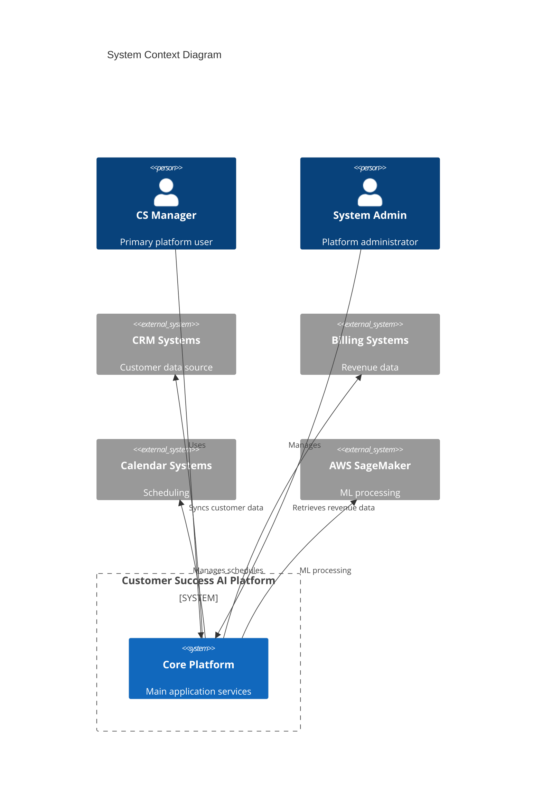

# Customer Success AI Platform

[](https://github.com/actions/workflows/build.yml)
[](https://codecov.io/gh/repo)
[](https://snyk.io/test/github/repo)
[](LICENSE)

An enterprise-grade predictive analytics and automation solution built on the Blitzy platform for preventing customer churn and capturing expansion opportunities.

## Quick Links
- [Documentation](docs/)
- [API Reference](docs/api/)
- [Contributing Guidelines](CONTRIBUTING.md)
- [Security Policy](SECURITY.md)
- [Deployment Guide](docs/deployment/)

## Overview

The Customer Success AI Platform is a comprehensive solution that addresses the critical business challenge of preventable customer churn, which costs SaaS companies 5-7% of annual revenue. By combining AI-powered predictions, automated interventions, and educational resources, the platform enables data-driven customer success operations at scale.

### Key Features
- Predictive churn analytics
- Automated intervention workflows
- Customer health scoring
- Revenue impact analysis
- Playbook automation
- Performance analytics

## System Architecture



## Technical Requirements

### Backend
- Python 3.11+
- Poetry 1.7.0+
- PostgreSQL 15+
- Redis 7.x
- AWS SageMaker
- FastAPI 0.100+
- SQLAlchemy 2.x

### Frontend
- Node.js 18.x
- TypeScript 5.0+
- npm
- React 18.x
- Blitzy UI Kit
- Redux Toolkit
- Vite

### Infrastructure
- AWS (ECS, ECR, Application Load Balancer)
- Datadog
- GitHub Actions
- Terraform 1.5+

## Getting Started

### Prerequisites
1. AWS account with appropriate permissions
2. Docker installed locally
3. Node.js 18.x and Python 3.11+
4. Terraform 1.5+
5. AWS CLI configured

### Installation

1. Clone the repository:
```bash
git clone https://github.com/organization/customer-success-ai-platform.git
cd customer-success-ai-platform
```

2. Install backend dependencies:
```bash
cd backend
poetry install
```

3. Install frontend dependencies:
```bash
cd frontend
npm install
```

4. Configure environment variables:
```bash
cp .env.example .env
# Edit .env with your configuration
```

5. Initialize infrastructure:
```bash
cd infrastructure
terraform init
terraform plan
terraform apply
```

## Development

### Local Development Setup
1. Start backend services:
```bash
poetry run uvicorn app.main:app --reload
```

2. Start frontend development server:
```bash
npm run dev
```

3. Access the application at `http://localhost:3000`

### Testing
```bash
# Backend tests
poetry run pytest

# Frontend tests
npm test
```

## Deployment

The platform uses GitHub Actions for CI/CD pipeline automation. Deployments are managed through Terraform and AWS ECS.

### Production Deployment
1. Create a production branch
2. Submit a pull request
3. Automated tests and security scans run
4. Upon approval, changes are deployed to staging
5. After staging validation, production deployment occurs

## Security

The platform implements enterprise-grade security measures:

- OAuth 2.0 + JWT authentication
- Role-based access control
- Data encryption at rest and in transit
- Regular security audits
- Compliance with SOC 2 and GDPR requirements

For detailed security information, see [SECURITY.md](SECURITY.md).

## Support

### Issue Reporting
Report issues through GitHub Issues following the provided templates.

### Documentation
Comprehensive documentation is available in the [docs](docs/) directory.

### Community
- GitHub Discussions for community engagement
- Regular office hours for enterprise customers
- Premium support channels for priority assistance

## Contributing

Please read [CONTRIBUTING.md](CONTRIBUTING.md) for details on our code of conduct and the process for submitting pull requests.

## License

This project is licensed under the terms specified in [LICENSE](LICENSE).

## Acknowledgments

- Blitzy platform team for core infrastructure support
- AWS for cloud infrastructure and ML services
- Open source community for various tools and libraries used in this project