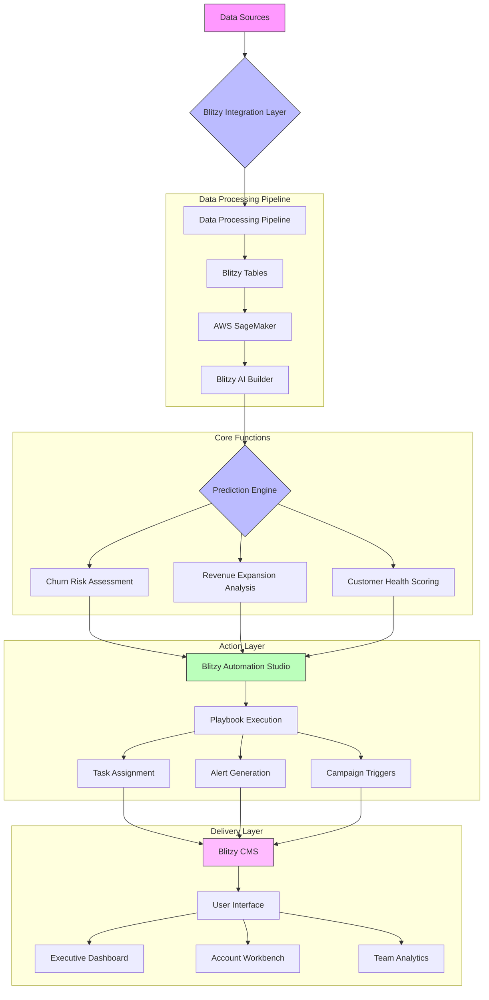
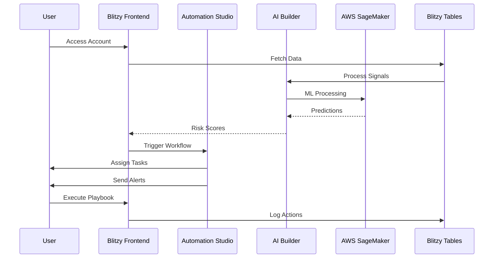
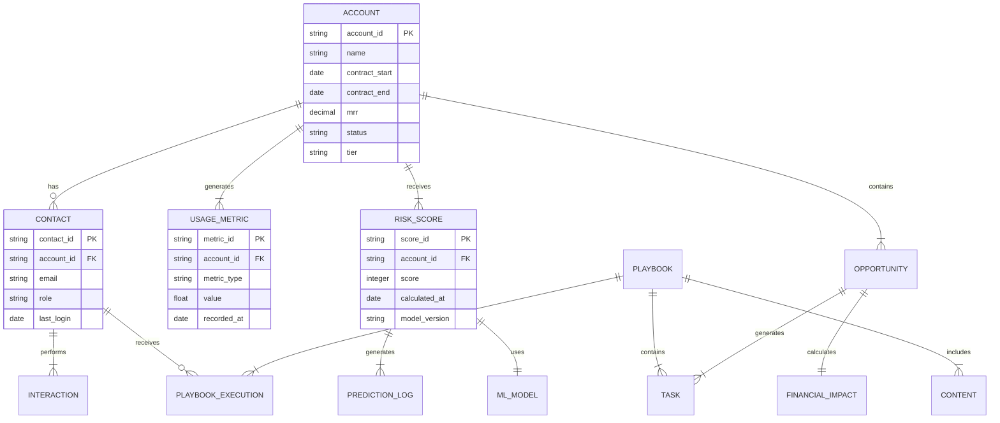
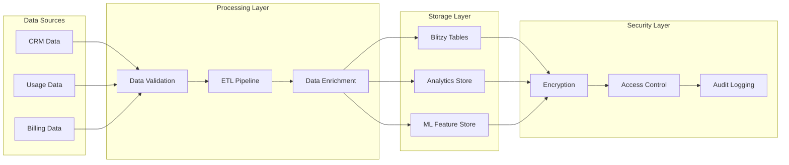
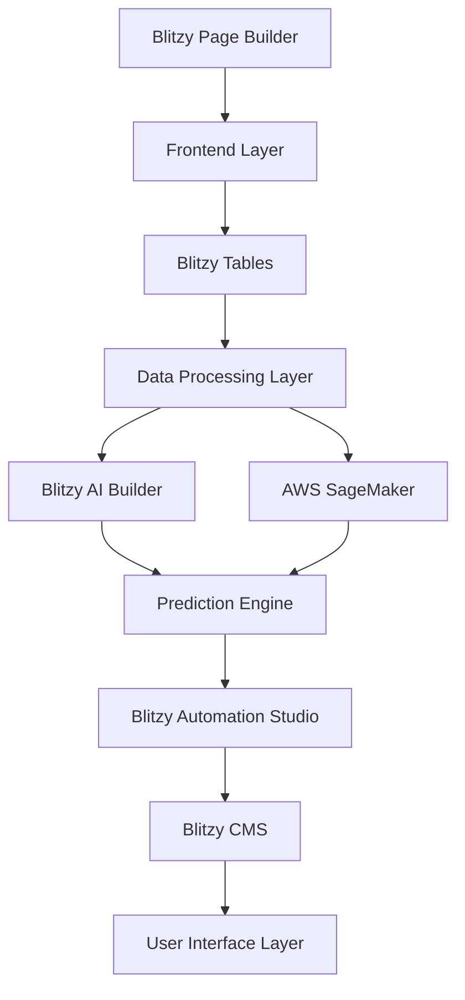

# Product Requirements Document (PRD)

# 1. INTRODUCTION

## 1.1 Purpose

This Software Requirements Specification (SRS) document provides a comprehensive description of the Customer Success AI Platform built on Blitzy. It is intended for:

- Development and engineering teams implementing the solution
- Product managers and stakeholders overseeing the project
- QA teams validating system functionality
- Technical writers creating documentation
- Customer Success teams providing feedback on requirements

## 1.2 Scope

The Customer Success AI Platform is a predictive analytics and automation solution that helps SaaS companies reduce churn and capture expansion revenue. The system encompasses:

### Core Capabilities
- AI-powered churn prediction using Blitzy's AI Builder and AWS SageMaker
- Revenue expansion opportunity identification through embedded analytics
- Automated retention workflow generation via Blitzy's Automation Studio
- Financial impact modeling with no-code calculators
- Content delivery through Blitzy's CMS

### Key Benefits
- Reduction in preventable customer churn (5-7% of annual revenue)
- Increased expansion revenue through proactive opportunity identification
- Streamlined customer success operations via automation
- Data-driven decision making supported by predictive insights
- Scalable intervention strategies through playbook templates

### System Boundaries
- Integrates with existing CRM and billing systems via 150+ native connectors
- Operates within Blitzy Pro tier limits (100K events/day)
- Supports up to 200 concurrent enterprise users
- Delivers sub-3 second prediction response times
- Maintains 99.9% system availability

# 2. PRODUCT DESCRIPTION

## 2.1 Product Perspective
The Customer Success AI Platform operates as a modular solution within the Blitzy ecosystem, leveraging existing enterprise infrastructure while introducing specialized predictive analytics capabilities. The system integrates with:

- Blitzy Core Platform
  - Page Builder for frontend interfaces
  - Tables for data management
  - Automation Studio for workflow execution
  - CMS for content delivery
  - AI Builder for prediction models

- External Systems
  - AWS SageMaker for advanced ML processing
  - CRM platforms via native connectors
  - Billing systems through API integration
  - Calendar systems via Blitzy-Calendar bridge

## 2.2 Product Functions
The platform delivers four primary function groups:

1. Predictive Analytics
   - Churn risk assessment
   - Revenue expansion modeling
   - Customer health scoring
   - Behavioral pattern analysis

2. Workflow Automation
   - Intervention playbook execution
   - Task assignment and tracking
   - Alert management
   - Campaign orchestration

3. Resource Management
   - Content delivery and tracking
   - Playbook template library
   - Best practice documentation
   - Training material distribution

4. Performance Analytics
   - Financial impact calculation
   - Benchmark comparison
   - ROI measurement
   - Team performance tracking

## 2.3 User Characteristics

### Customer Success Managers (Primary Users)
- Technical proficiency: Intermediate
- Usage frequency: Daily
- Key needs: Account monitoring, intervention execution, playbook access

### CS Operations Leaders (Power Users)
- Technical proficiency: Advanced
- Usage frequency: Daily
- Key needs: Team management, strategy development, performance analysis

### Executive Stakeholders (Secondary Users)
- Technical proficiency: Basic
- Usage frequency: Weekly
- Key needs: High-level metrics, financial impact assessment

### System Administrators (Technical Users)
- Technical proficiency: Expert
- Usage frequency: As needed
- Key needs: Integration management, security configuration, user administration

## 2.4 Constraints

### Technical Constraints
- Blitzy Pro tier event limit: 100K events/day
- Maximum concurrent users: 200
- Response time requirement: Sub-3 seconds for predictions
- Storage limitations: Based on Blitzy Enterprise plan
- API rate limits: Per integration partner specifications

### Business Constraints
- GDPR and data privacy compliance requirements
- Budget alignment with Blitzy Enterprise pricing
- Implementation timeline: Based on Blitzy deployment schedule
- Resource availability: Internal IT support capacity

## 2.5 Assumptions and Dependencies

### Assumptions
- Users have basic familiarity with Blitzy interface
- Customer data quality meets minimum requirements
- Internet connectivity meets platform requirements
- Business processes can adapt to automated workflows

### Dependencies
- Blitzy platform stability and availability
- AWS SageMaker API accessibility
- Third-party integration availability
- Data source system uptime
- SSO provider functionality
- Regular data synchronization from source systems

# 3. PROCESS FLOWCHART

# 4. FUNCTIONAL REQUIREMENTS

## 4.1 Predictive Analytics Engine

### ID: F001
### Description
Core prediction system leveraging Blitzy AI Builder and AWS SageMaker for churn risk assessment and revenue expansion modeling.
### Priority: High

| Requirement ID | Requirement Description | Acceptance Criteria |
|---------------|------------------------|-------------------|
| F001.1 | Process customer behavioral data through Blitzy Tables | - Handle 100K daily events - Sub-3s data processing time - Maintain data integrity |
| F001.2 | Generate churn risk scores via ML models | - 0-100 risk scoring scale - Update every 24 hours - 90% prediction accuracy |
| F001.3 | Identify expansion opportunities | - Revenue impact calculation - Probability scoring - Product fit analysis |
| F001.4 | Calculate customer health scores | - Weighted metric aggregation - Daily recalculation - Trend analysis |

## 4.2 Workflow Automation System

### ID: F002
### Description
Automated intervention system built on Blitzy's Automation Studio for playbook execution and task management.
### Priority: High

| Requirement ID | Requirement Description | Acceptance Criteria |
|---------------|------------------------|-------------------|
| F002.1 | Execute retention playbooks | - Trigger-based activation - Multi-step workflows - Success tracking |
| F002.2 | Assign and track CS tasks | - Auto-assignment rules - Due date tracking - Completion monitoring |
| F002.3 | Generate alerts and notifications | - Multi-channel delivery - Priority-based routing - Alert acknowledgment |
| F002.4 | Orchestrate customer campaigns | - Template-based creation - A/B testing capability - Performance tracking |

## 4.3 Resource Management Platform

### ID: F003
### Description
Content and resource delivery system utilizing Blitzy's CMS for playbook and training material distribution.
### Priority: Medium

| Requirement ID | Requirement Description | Acceptance Criteria |
|---------------|------------------------|-------------------|
| F003.1 | Manage playbook templates | - Version control - Template categorization - Usage analytics |
| F003.2 | Deliver training content | - Role-based access - Progress tracking - Completion certification |
| F003.3 | Track resource utilization | - Usage metrics - Effectiveness scoring - ROI calculation |
| F003.4 | Maintain best practices library | - Regular updates - Search functionality - Feedback collection |

## 4.4 Analytics Dashboard

### ID: F004
### Description
Performance monitoring system using Blitzy Analytics Premium widgets for metrics and ROI tracking.
### Priority: Medium

| Requirement ID | Requirement Description | Acceptance Criteria |
|---------------|------------------------|-------------------|
| F004.1 | Calculate financial impact | - Revenue tracking - Cost analysis - ROI measurement |
| F004.2 | Compare benchmark metrics | - Industry standards - Historical trends - Peer comparison |
| F004.3 | Track team performance | - Individual metrics - Team aggregates - Goal tracking |
| F004.4 | Generate executive reports | - One-click PDF export - Custom visualization - Scheduled delivery |

## 4.5 Integration Framework

### ID: F005
### Description
Data integration system leveraging Blitzy's 150+ native connectors and Zapier bridge.
### Priority: High

| Requirement ID | Requirement Description | Acceptance Criteria |
|---------------|------------------------|-------------------|
| F005.1 | Connect to CRM systems | - Bi-directional sync - Field mapping - Error handling |
| F005.2 | Integrate billing platforms | - Revenue data sync - Usage metrics - Payment status |
| F005.3 | Link calendar systems | - Event scheduling - Availability sync - Meeting management |
| F005.4 | Enable custom integrations | - API accessibility - Webhook support - Custom connector creation |

# 5. NON-FUNCTIONAL REQUIREMENTS

## 5.1 Performance Requirements

| Requirement | Specification | Success Metric |
|------------|---------------|----------------|
| Response Time | Maximum 3 seconds for predictions | 95th percentile under threshold |
| API Throughput | 100,000 events per day | Zero throttling incidents |
| Database Performance | Sub-100ms query response | 99% of queries within SLA |
| Resource Utilization | Maximum 70% CPU/memory usage | Monitored via Blitzy Analytics |
| Batch Processing | Complete within 4-hour window | Daily ETL success rate >99% |

## 5.2 Safety Requirements

| Requirement | Specification | Implementation |
|------------|---------------|----------------|
| Data Backup | Hourly incremental, daily full backup | Blitzy Cloud Backup service |
| Disaster Recovery | RPO: 1 hour, RTO: 4 hours | Multi-region failover |
| Error Handling | Graceful degradation of services | Blitzy Error Boundary system |
| Data Validation | Input sanitization and validation | Blitzy Forms validation engine |
| Audit Logging | Complete action trail retention | Blitzy Activity Log |

## 5.3 Security Requirements

| Requirement | Specification | Implementation |
|------------|---------------|----------------|
| Authentication | Multi-factor authentication | Blitzy Enterprise SSO |
| Authorization | Role-based access control | Blitzy Roles framework |
| Data Encryption | AES-256 at rest, TLS 1.3 in transit | AWS KMS integration |
| Session Management | 30-minute timeout, secure tokens | Blitzy Session Manager |
| API Security | OAuth 2.0, rate limiting | Blitzy API Gateway |

## 5.4 Quality Requirements

### 5.4.1 Availability
- System uptime: 99.9% (excluding planned maintenance)
- Planned maintenance: Maximum 4 hours/month
- Redundancy: Active-passive configuration

### 5.4.2 Maintainability
- Code coverage: Minimum 80%
- Documentation: Updated within 24 hours of changes
- Module coupling: Maximum 30% interdependency

### 5.4.3 Usability
- Learning curve: < 2 hours for basic operations
- Error messages: Clear, actionable guidance
- Accessibility: WCAG 2.1 AA compliance

### 5.4.4 Scalability
- Linear performance up to 200 concurrent users
- Storage expansion up to 10TB
- Automatic resource scaling via Blitzy Cloud

### 5.4.5 Reliability
- Mean Time Between Failures (MTBF): 720 hours
- Mean Time To Repair (MTTR): < 4 hours
- Error rate: < 0.1% of transactions

## 5.5 Compliance Requirements

| Requirement | Specification | Validation |
|------------|---------------|------------|
| GDPR | Data privacy and protection | Annual audit |
| SOC 2 Type II | Security and availability | Semi-annual certification |
| ISO 27001 | Information security | Annual certification |
| CCPA | California privacy compliance | Quarterly review |
| HIPAA | Healthcare data protection | Annual assessment |

# 6. DATA REQUIREMENTS

## 6.1 Data Models

## 6.2 Data Storage

### 6.2.1 Storage Requirements

| Data Type | Storage Location | Retention Period | Backup Frequency |
|-----------|-----------------|------------------|------------------|
| Account Data | Blitzy Tables | 7 years | Hourly |
| Usage Metrics | Blitzy Analytics | 2 years | Daily |
| ML Models | AWS SageMaker | Current + 3 versions | Weekly |
| Playbook Content | Blitzy CMS | 3 years | Daily |
| Interaction Logs | Blitzy Activity Log | 1 year | Daily |

### 6.2.2 Data Redundancy
- Primary storage: Blitzy Cloud (active)
- Secondary storage: AWS S3 (passive)
- Geographic redundancy: Multi-region replication
- Redundancy factor: 3x for critical data

### 6.2.3 Backup Strategy
- Incremental backups: Hourly
- Full backups: Daily
- Retention schedule: 30 daily, 12 monthly, 7 yearly
- Backup validation: Weekly integrity checks
- Recovery testing: Monthly DR drills

## 6.3 Data Processing

### 6.3.1 Data Security Controls
- Encryption at rest: AES-256
- Encryption in transit: TLS 1.3
- Field-level encryption for PII
- Role-based access control via Blitzy Roles
- Data masking for non-production environments

### 6.3.2 Data Processing Requirements
- Daily processing window: 00:00-04:00 UTC
- Maximum latency: 15 minutes for real-time data
- Batch processing: 100K records per hour
- Error threshold: <0.1% failure rate
- Data quality score: >98% accuracy

### 6.3.3 Data Governance
- GDPR compliance through Blitzy's governance module
- Data classification: Public, Internal, Confidential, Restricted
- Data lineage tracking via Blitzy Activity Log
- Automated PII detection and handling
- Regular data quality assessments

# 7. EXTERNAL INTERFACES

## 7.1 User Interfaces

### 7.1.1 General Requirements
- Responsive design supporting 1024x768 minimum resolution
- WCAG 2.1 AA compliance for accessibility
- Dark/light mode support via Blitzy Theme Engine
- Maximum 3-click navigation depth
- Consistent Blitzy Enterprise design system

### 7.1.2 Core Interface Components

| Interface | Description | Key Components |
|-----------|-------------|----------------|
| Executive Dashboard | High-level metrics view | - KPI cards - Revenue impact charts - Team performance grid - Risk distribution heat map |
| Account Workbench | Account management interface | - Health score timeline - Interaction history - Playbook execution status - Revenue forecasting |
| Team Analytics | Performance tracking view | - Task completion metrics - Response time tracking - Success rate indicators - Workload distribution |
| Playbook Builder | Workflow creation interface | - Drag-drop automation builder - Template library - Logic flow designer - Success metrics |

## 7.2 Hardware Interfaces

### 7.2.1 Client Requirements
- Modern web browser (Chrome 90+, Firefox 88+, Safari 14+, Edge 90+)
- Minimum 4GB RAM for optimal performance
- 1080p display recommended for dashboard views
- Network bandwidth: 5 Mbps minimum

### 7.2.2 Server Requirements
- AWS infrastructure via Blitzy Cloud
- Load balancer configuration for high availability
- Auto-scaling group settings
- Storage requirements as per Blitzy Enterprise tier

## 7.3 Software Interfaces

### 7.3.1 External System Integration

| System Type | Integration Method | Data Flow |
|-------------|-------------------|-----------|
| CRM Systems | Native Blitzy Connectors | Bi-directional sync of customer data |
| Billing Platforms | REST APIs | Usage and revenue data import |
| Calendar Systems | Blitzy-Calendar Bridge | Event and availability sync |
| ML Services | AWS SageMaker API | Model training and prediction requests |
| Communication Tools | Zapier Bridge | Alert and notification routing |

### 7.3.2 Internal System Integration

## 7.4 Communication Interfaces

### 7.4.1 Network Protocols
- HTTPS/TLS 1.3 for all web traffic
- WebSocket for real-time updates
- SMTP for email notifications
- REST/JSON for API communications
- GraphQL for complex data queries

### 7.4.2 Data Exchange Formats

| Format | Usage | Validation |
|--------|-------|------------|
| JSON | API responses | JSON Schema validation |
| CSV | Bulk data export | RFC 4180 compliance |
| PDF | Report generation | PDF/A-1b standard |
| XML | Legacy system integration | XSD schema validation |
| Protocol Buffers | High-performance data exchange | Schema registry validation |

### 7.4.3 Integration Authentication
- OAuth 2.0 for API authentication
- JWT tokens for session management
- API keys for external service access
- SAML 2.0 for SSO integration
- Mutual TLS for secure service communication

# 8. APPENDICES

## 8.1 GLOSSARY

| Term | Definition |
|------|------------|
| Churn Risk Score | A numerical value between 0-100 indicating the likelihood of customer cancellation |
| Customer Health Score | Weighted aggregate metric combining usage, engagement, and support metrics |
| Expansion Revenue | Additional revenue generated from existing customers through upgrades or add-ons |
| Intervention Playbook | Pre-defined sequence of actions triggered by specific customer behavior patterns |
| ML Feature Store | Centralized repository of processed data used for machine learning model training |
| Predictive Analytics | Use of data, statistical algorithms, and machine learning to identify future outcomes |
| Revenue Impact | Calculated financial effect of customer churn or expansion opportunities |

## 8.2 ACRONYMS

| Acronym | Expansion |
|---------|-----------|
| API | Application Programming Interface |
| CMS | Content Management System |
| CRM | Customer Relationship Management |
| ETL | Extract, Transform, Load |
| GDPR | General Data Protection Regulation |
| JWT | JSON Web Token |
| KMS | Key Management Service |
| KPI | Key Performance Indicator |
| ML | Machine Learning |
| MRR | Monthly Recurring Revenue |
| PII | Personally Identifiable Information |
| ROI | Return on Investment |
| RPO | Recovery Point Objective |
| RTO | Recovery Time Objective |
| SAML | Security Assertion Markup Language |
| SLA | Service Level Agreement |
| SSO | Single Sign-On |
| TLS | Transport Layer Security |

## 8.3 ADDITIONAL REFERENCES

| Resource | Description | URL |
|----------|-------------|-----|
| Blitzy AI Builder Documentation | Technical guide for AI model implementation | https://docs.blitzy.com/ai-builder |
| AWS SageMaker Integration Guide | Setup instructions for ML service connection | https://aws.amazon.com/sagemaker/docs |
| Blitzy Enterprise Security Whitepaper | Detailed security implementation guidelines | https://enterprise.blitzy.com/security |
| Customer Success Metrics Handbook | Industry standard KPI definitions and benchmarks | https://resources.blitzy.com/cs-metrics |
| Blitzy API Reference | Complete API documentation for custom integrations | https://api.blitzy.com/docs |

## 8.4 REVISION HISTORY

| Version | Date | Author | Changes |
|---------|------|--------|---------|
| 1.0 | 2024-01-15 | Product Team | Initial document creation |
| 1.1 | 2024-01-20 | Technical Team | Added technical specifications |
| 1.2 | 2024-01-25 | Security Team | Updated security requirements |
| 1.3 | 2024-01-30 | QA Team | Added acceptance criteria |