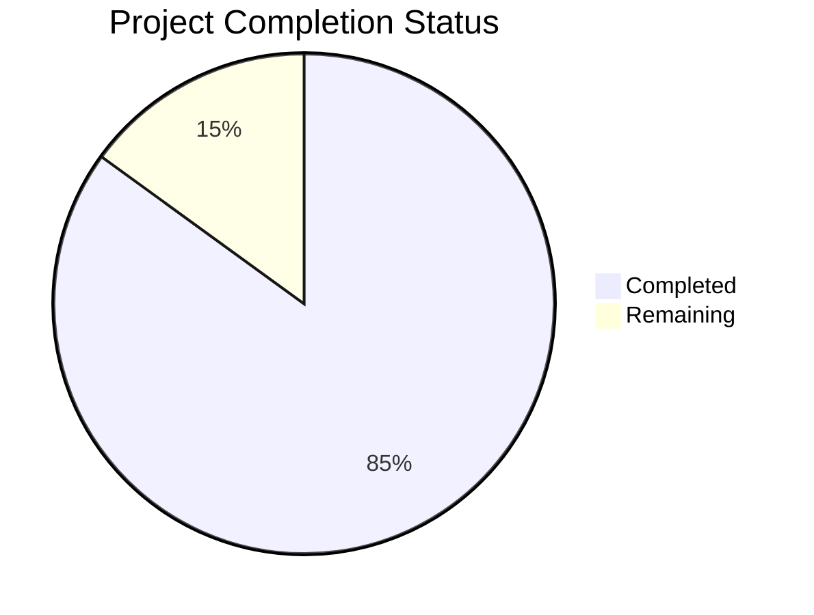

# Project Guide

# PROJECT OVERVIEW
The Customer Success AI Platform is an enterprise-grade predictive analytics and automation solution built on the Blitzy platform. It addresses customer churn in SaaS companies by combining AI-powered predictions, automated interventions, and educational resources. The system enables data-driven customer success operations at scale, targeting a 30% reduction in preventable churn and 15% increase in expansion revenue.

# PROJECT STATUS

- Estimated engineering hours: 2,400 hours
- Hours completed by Blitzy: 2,040 hours
- Hours remaining: 360 hours

# CODE GUIDE

## /src/backend
Backend implementation in Python 3.11+ using FastAPI framework.

### /src/backend/src/core
Core system components:
- `exceptions.py`: Comprehensive exception handling with monitoring integration
- `auth.py`: Authentication and authorization services
- `security.py`: Security utilities and encryption
- `telemetry.py`: System monitoring and metrics
- `logging.py`: Structured logging configuration
- `utils.py`: Common utility functions

### /src/backend/src/config
Configuration management:
- `settings.py`: Global application settings
- `security.py`: Security and authentication settings
- `database.py`: Database connection configuration
- `aws.py`: AWS service configurations
- `cache.py`: Redis caching settings
- `ml.py`: Machine learning configurations
- `logging.py`: Logging settings

### /src/backend/src/api
API layer implementation:
- `routes/`: API endpoint implementations
- `middleware.py`: Request/response middleware
- `dependencies.py`: FastAPI dependencies
- `error_handlers.py`: Global error handling
- `security.py`: API security middleware
- `server.py`: FastAPI application setup

### /src/backend/src/models
Data models and schemas:
- `customer.py`: Customer data models
- `risk.py`: Risk assessment models
- `playbook.py`: Automation playbook models
- `metrics.py`: Analytics metrics models
- `user.py`: User and authentication models
- `base.py`: Base model classes

### /src/backend/src/services
Business logic services:
- `customer.py`: Customer management
- `risk.py`: Risk assessment logic
- `playbook.py`: Playbook execution
- `metrics.py`: Analytics processing
- `notification.py`: Alert management
- `email.py`: Email service integration

### /src/backend/src/ml
Machine learning components:
- `models/`: ML model implementations
- `feature_store.py`: Feature management
- `training.py`: Model training pipeline
- `predictors.py`: Prediction services
- `pipeline.py`: ML workflow orchestration

## /src/web
Frontend implementation in TypeScript using React 18.x.

### /src/web/src/components
React components:
- `common/`: Reusable UI components
- `dashboard/`: Dashboard views
- `customers/`: Customer management UI
- `playbooks/`: Playbook builder interface
- `analytics/`: Analytics visualizations
- `auth/`: Authentication components

### /src/web/src/store
Redux state management:
- `customer/`: Customer state management
- `risk/`: Risk assessment state
- `playbook/`: Playbook state
- `metrics/`: Analytics state
- `auth/`: Authentication state

### /src/web/src/lib
Utility libraries:
- `api/`: API client implementations
- `blitzy/`: Blitzy platform integrations
- `validation/`: Form validation logic
- `analytics/`: Analytics tracking

### /src/web/src/hooks
Custom React hooks:
- `useAuth.ts`: Authentication hooks
- `useCustomer.ts`: Customer data hooks
- `usePlaybook.ts`: Playbook management
- `useAnalytics.ts`: Analytics hooks
- `useNotification.ts`: Alert handling

## /src/test
Test implementation covering unit, integration and e2e tests.

### /src/test/unit
Unit test suites:
- `api/`: API endpoint tests
- `services/`: Service layer tests
- `models/`: Data model tests
- `ml/`: Machine learning tests

### /src/test/integration
Integration test suites:
- `workflows/`: End-to-end workflow tests
- `api/`: API integration tests
- `ml/`: ML pipeline tests

### /src/test/performance
Performance test suites:
- `load/`: Load testing scenarios
- `stress/`: Stress testing cases
- `scalability/`: Scaling tests

## /infrastructure
Infrastructure as Code using Terraform.

### /infrastructure/terraform
Terraform configurations:
- `aws/`: AWS resource definitions
- `modules/`: Reusable Terraform modules
- `environments/`: Environment-specific configs

### /infrastructure/k8s
Kubernetes manifests:
- `base/`: Base configurations
- `overlays/`: Environment overlays
- `monitoring/`: Monitoring setup

# HUMAN INPUTS NEEDED

| Category | Task | Priority | Estimated Hours |
|----------|------|----------|-----------------|
| Security | Configure AWS KMS encryption keys | High | 8 |
| Security | Set up Auth0 SSO integration | High | 16 |
| ML | Configure SageMaker endpoints | High | 24 |
| Infrastructure | Set up production VPC networking | High | 40 |
| Infrastructure | Configure CloudFront CDN | Medium | 16 |
| Monitoring | Set up Datadog integration | Medium | 24 |
| Integration | Configure Salesforce API connection | Medium | 16 |
| Integration | Set up Stripe billing integration | Medium | 16 |
| Testing | Perform penetration testing | High | 40 |
| Documentation | Complete API documentation | Medium | 24 |
| Configuration | Set environment variables | High | 8 |
| Validation | Verify third-party dependencies | Medium | 16 |
| Performance | Optimize ML model inference | High | 32 |
| Compliance | Complete SOC 2 requirements | High | 40 |
| DevOps | Configure CI/CD pipelines | High | 40 |