# Technical Specifications

# 1. INTRODUCTION

## 1.1 EXECUTIVE SUMMARY

The Customer Success AI Platform is an enterprise-grade predictive analytics and automation solution built on the Blitzy platform. It addresses the critical business challenge of preventable customer churn, which costs SaaS companies 5-7% of annual revenue, while capturing missed expansion opportunities. The system combines AI-powered predictions, automated interventions, and educational resources to enable data-driven customer success operations at scale.

Primary stakeholders include Customer Success teams, CS Operations leaders, and executive stakeholders who will leverage the platform to identify at-risk accounts, execute retention strategies, and drive expansion revenue through predictive insights and automated workflows.

## 1.2 SYSTEM OVERVIEW

### Project Context

| Aspect | Description |
|--------|-------------|
| Market Position | Enterprise CS platform targeting mid-market and enterprise SaaS companies |
| Current Limitations | Manual intervention processes, reactive retention strategies, siloed customer data |
| Enterprise Integration | Leverages Blitzy's ecosystem for seamless integration with existing enterprise systems |

### High-Level Description

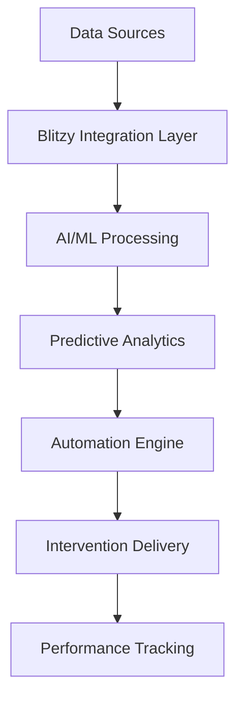
```mermaid
graph TD
    A[Data Sources] --> B[Blitzy Integration Layer]
    B --> C[AI/ML Processing]
    C --> D[Predictive Analytics]
    D --> E[Automation Engine]
    E --> F[Intervention Delivery]
    F --> G[Performance Tracking]
```

| Component | Implementation Approach |
|-----------|------------------------|
| Frontend Layer | Blitzy Page Builder with premium dashboard templates |
| Data Processing | Blitzy Tables with smart relationships |
| ML Processing | AWS SageMaker + Blitzy AI Builder |
| Automation | Blitzy Automation Studio |
| Content Delivery | Blitzy CMS module |

### Success Criteria

| Category | Target Metrics |
|----------|---------------|
| Churn Reduction | 30% decrease in preventable churn |
| Revenue Impact | 15% increase in expansion revenue |
| Operational Efficiency | 40% reduction in manual interventions |
| User Adoption | 85% CSM activation within 30 days |
| System Performance | 99.9% uptime, sub-3s predictions |

## 1.3 SCOPE

### In-Scope Elements

#### Core Features and Functionalities

| Feature Category | Key Capabilities |
|-----------------|------------------|
| Predictive Analytics | - Churn risk assessment<br>- Expansion opportunity identification<br>- Customer health scoring |
| Workflow Automation | - Intervention playbook execution<br>- Task assignment and tracking<br>- Alert management |
| Resource Management | - Content delivery and tracking<br>- Playbook template library<br>- Best practice documentation |
| Performance Analytics | - Financial impact calculation<br>- Benchmark comparison<br>- ROI measurement |

#### Implementation Boundaries

| Boundary Type | Coverage |
|--------------|----------|
| System Integration | 150+ native connectors via Blitzy |
| User Capacity | 200 concurrent enterprise users |
| Data Processing | 100K events/day (Blitzy Pro tier) |
| Geographic Coverage | Global deployment with regional data centers |

### Out-of-Scope Elements

- Custom machine learning model development
- Direct billing system modifications
- Legacy system migration services
- Custom mobile application development
- Third-party marketplace integration
- White-label reseller capabilities
- On-premises deployment options
- Real-time video integration
- Social media monitoring
- Customer support ticketing system

# 2. SYSTEM ARCHITECTURE

## 2.1 High-Level Architecture

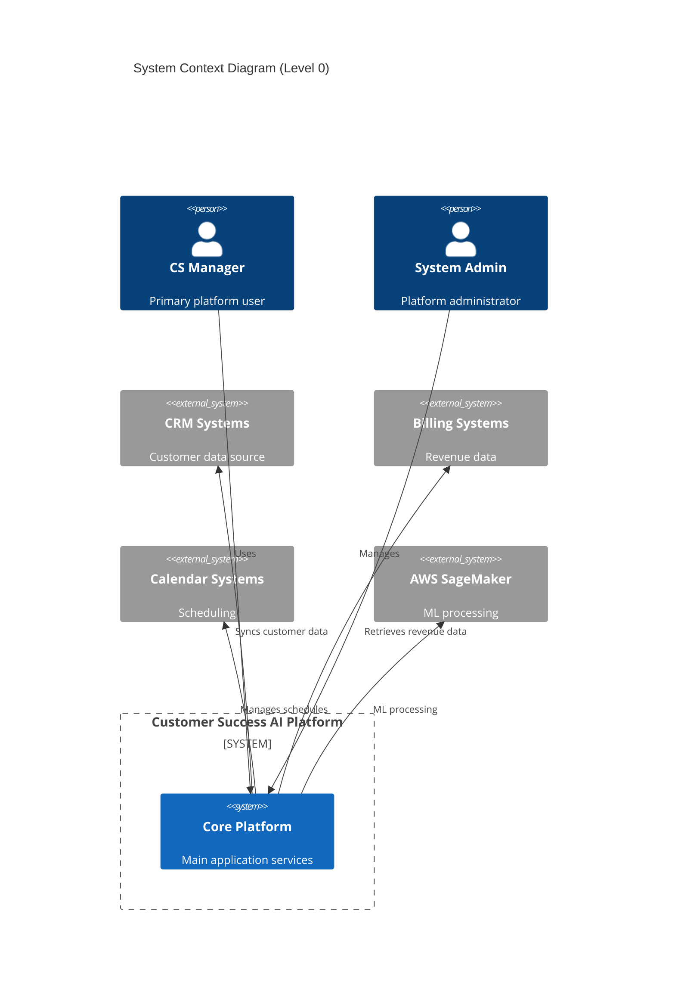
```mermaid
C4Context
    title System Context Diagram (Level 0)

    Person(csm, "CS Manager", "Primary platform user")
    Person(admin, "System Admin", "Platform administrator")
    
    System_Boundary(platform, "Customer Success AI Platform") {
        System(core, "Core Platform", "Main application services")
    }

    System_Ext(crm, "CRM Systems", "Customer data source")
    System_Ext(billing, "Billing Systems", "Revenue data")
    System_Ext(calendar, "Calendar Systems", "Scheduling")
    System_Ext(ml, "AWS SageMaker", "ML processing")

    Rel(csm, core, "Uses")
    Rel(admin, core, "Manages")
    Rel(core, crm, "Syncs customer data")
    Rel(core, billing, "Retrieves revenue data")
    Rel(core, calendar, "Manages schedules")
    Rel(core, ml, "ML processing")
```

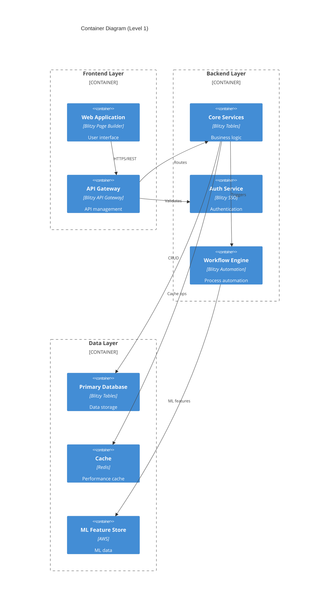
```mermaid
C4Container
    title Container Diagram (Level 1)

    Container_Boundary(frontend, "Frontend Layer") {
        Container(web, "Web Application", "Blitzy Page Builder", "User interface")
        Container(api_gateway, "API Gateway", "Blitzy API Gateway", "API management")
    }

    Container_Boundary(backend, "Backend Layer") {
        Container(core_services, "Core Services", "Blitzy Tables", "Business logic")
        Container(auth, "Auth Service", "Blitzy SSO", "Authentication")
        Container(workflow, "Workflow Engine", "Blitzy Automation", "Process automation")
    }

    Container_Boundary(data, "Data Layer") {
        Container(db, "Primary Database", "Blitzy Tables", "Data storage")
        Container(cache, "Cache", "Redis", "Performance cache")
        Container(ml_store, "ML Feature Store", "AWS", "ML data")
    }

    Rel(web, api_gateway, "HTTPS/REST")
    Rel(api_gateway, auth, "Validates")
    Rel(api_gateway, core_services, "Routes")
    Rel(core_services, workflow, "Triggers")
    Rel(core_services, db, "CRUD")
    Rel(core_services, cache, "Cache ops")
    Rel(workflow, ml_store, "ML features")
```

## 2.2 Component Details

### 2.2.1 Core Components

| Component | Technology | Purpose | Scaling Strategy |
|-----------|------------|---------|-----------------|
| Frontend Application | Blitzy Page Builder | User interface delivery | Horizontal scaling via CDN |
| API Gateway | Blitzy API Gateway | Request routing, authentication | Auto-scaling based on request volume |
| Core Services | Blitzy Tables | Business logic processing | Horizontal scaling with load balancing |
| Workflow Engine | Blitzy Automation | Process automation | Queue-based scaling |
| ML Processing | AWS SageMaker | Predictive analytics | On-demand compute scaling |

### 2.2.2 Data Components

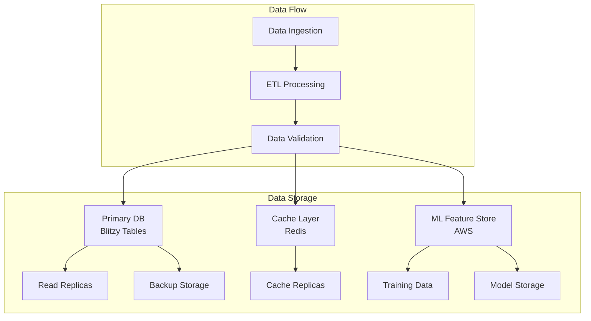
```mermaid
graph TD
    subgraph Data Storage
        A[Primary DB<br>Blitzy Tables] --> B[Read Replicas]
        A --> C[Backup Storage]
        D[Cache Layer<br>Redis] --> E[Cache Replicas]
        F[ML Feature Store<br>AWS] --> G[Training Data]
        F --> H[Model Storage]
    end

    subgraph Data Flow
        I[Data Ingestion] --> J[ETL Processing]
        J --> K[Data Validation]
        K --> A
        K --> D
        K --> F
    end
```

## 2.3 Technical Decisions

### 2.3.1 Architecture Patterns

| Pattern | Implementation | Justification |
|---------|---------------|---------------|
| Microservices | Domain-based services | Scalability and maintenance |
| Event-Driven | Message queues for workflows | Asynchronous processing |
| CQRS | Separate read/write paths | Performance optimization |
| Cache-Aside | Redis for frequent data | Response time improvement |
| Circuit Breaker | Service resilience | Fault tolerance |

### 2.3.2 Communication Patterns

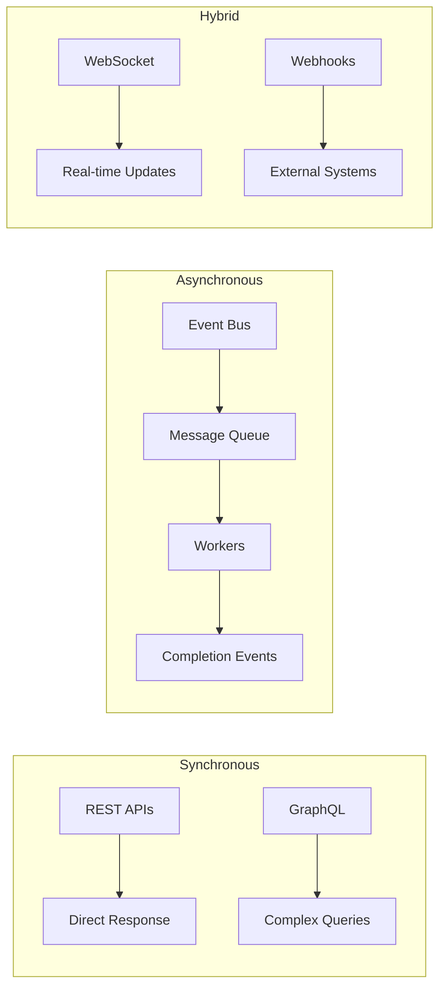
```mermaid
flowchart LR
    subgraph Synchronous
        A[REST APIs] --> B[Direct Response]
        C[GraphQL] --> D[Complex Queries]
    end

    subgraph Asynchronous
        E[Event Bus] --> F[Message Queue]
        F --> G[Workers]
        G --> H[Completion Events]
    end

    subgraph Hybrid
        I[WebSocket] --> J[Real-time Updates]
        K[Webhooks] --> L[External Systems]
    end
```

## 2.4 Cross-Cutting Concerns

### 2.4.1 System Monitoring

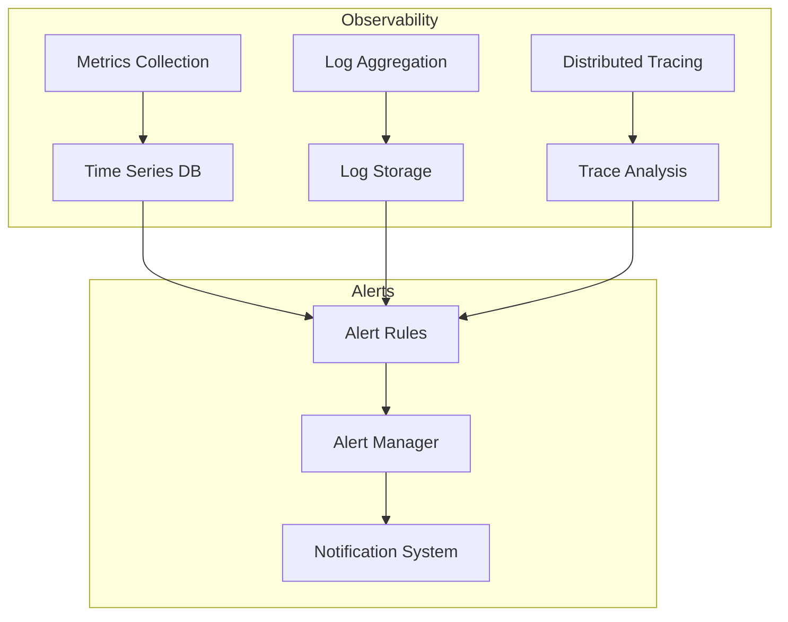
```mermaid
graph TD
    subgraph Observability
        A[Metrics Collection] --> B[Time Series DB]
        C[Log Aggregation] --> D[Log Storage]
        E[Distributed Tracing] --> F[Trace Analysis]
    end

    subgraph Alerts
        B --> G[Alert Rules]
        D --> G
        F --> G
        G --> H[Alert Manager]
        H --> I[Notification System]
    end
```

### 2.4.2 Security Architecture

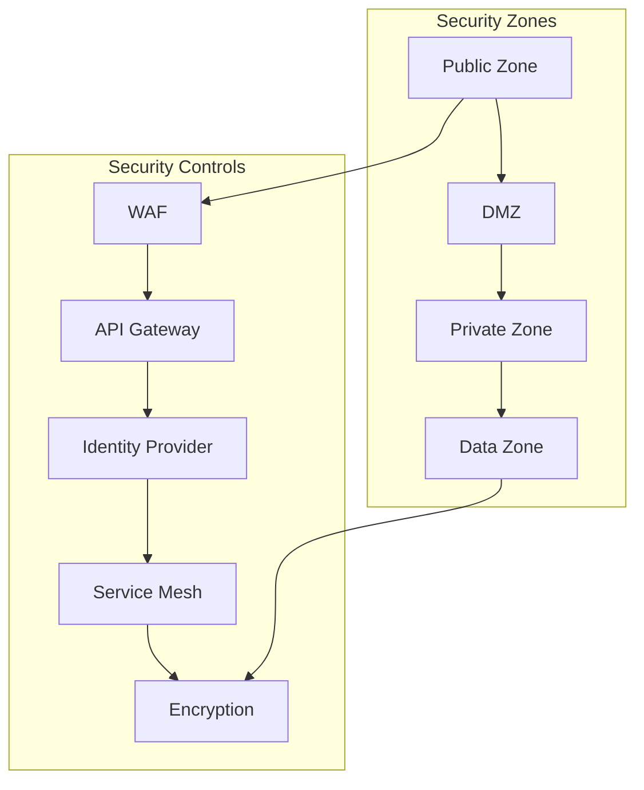
```mermaid
flowchart TB
    subgraph Security Zones
        A[Public Zone] --> B[DMZ]
        B --> C[Private Zone]
        C --> D[Data Zone]
    end

    subgraph Security Controls
        E[WAF] --> F[API Gateway]
        F --> G[Identity Provider]
        G --> H[Service Mesh]
        H --> I[Encryption]
    end

    A --> E
    D --> I
```

## 2.5 Deployment Architecture

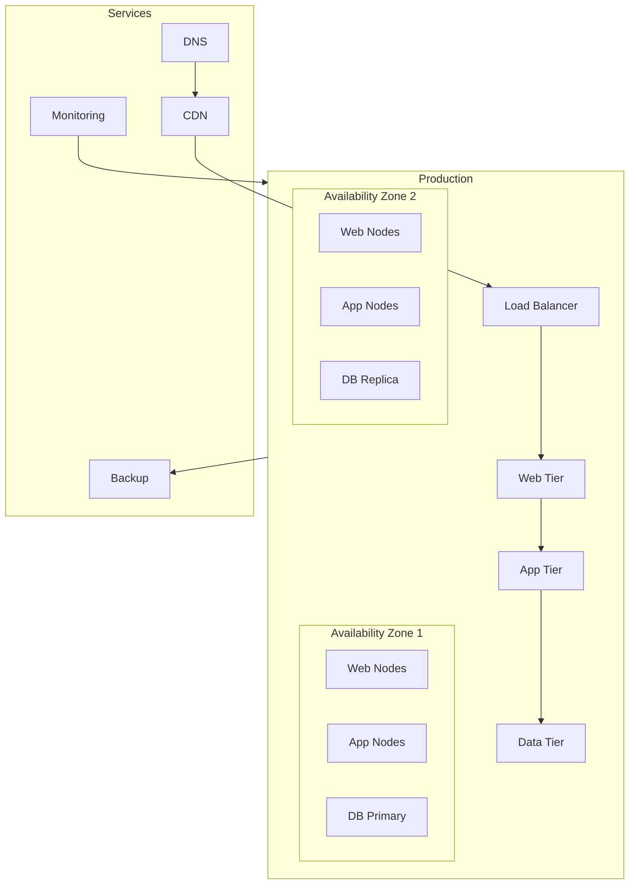
```mermaid
graph TB
    subgraph Production
        A[Load Balancer] --> B[Web Tier]
        B --> C[App Tier]
        C --> D[Data Tier]
        
        subgraph Availability Zone 1
            B1[Web Nodes]
            C1[App Nodes]
            D1[DB Primary]
        end
        
        subgraph Availability Zone 2
            B2[Web Nodes]
            C2[App Nodes]
            D2[DB Replica]
        end
    end

    subgraph Services
        E[CDN]
        F[DNS]
        G[Monitoring]
        H[Backup]
    end

    E --> A
    F --> E
    G --> Production
    Production --> H
```

# 3. SYSTEM COMPONENTS ARCHITECTURE

## 3.1 USER INTERFACE DESIGN

### 3.1.1 Design Specifications

| Category | Requirements |
|----------|--------------|
| Visual Hierarchy | - Blitzy Enterprise Design System compliance<br>- Z-pattern layout for dashboards<br>- F-pattern for content-heavy pages |
| Component Library | - Blitzy Premium UI components<br>- Custom CS-specific widgets<br>- Standardized data visualization components |
| Responsive Design | - Breakpoints: 320px, 768px, 1024px, 1440px<br>- Mobile-first approach<br>- Fluid grid system |
| Accessibility | - WCAG 2.1 Level AA compliance<br>- ARIA landmarks and labels<br>- Keyboard navigation support |
| Browser Support | - Chrome 90+<br>- Firefox 88+<br>- Safari 14+<br>- Edge 90+ |
| Theme Support | - Light/Dark mode via Blitzy Theme Engine<br>- Custom brand color schemes<br>- High contrast mode |
| i18n/l10n | - RTL layout support<br>- Multi-language UI (10 languages)<br>- Date/number formatting |

### 3.1.2 Interface Elements

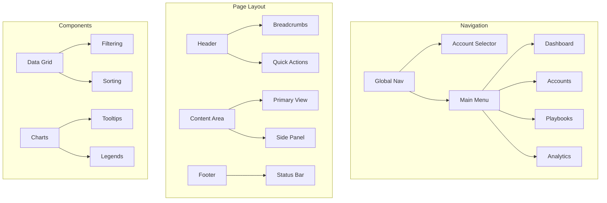
```mermaid
flowchart TD
    subgraph Navigation
        A[Global Nav] --> B[Account Selector]
        A --> C[Main Menu]
        C --> D[Dashboard]
        C --> E[Accounts]
        C --> F[Playbooks]
        C --> G[Analytics]
    end

    subgraph Page Layout
        H[Header] --> I[Breadcrumbs]
        H --> J[Quick Actions]
        K[Content Area] --> L[Primary View]
        K --> M[Side Panel]
        N[Footer] --> O[Status Bar]
    end

    subgraph Components
        P[Data Grid] --> Q[Filtering]
        P --> R[Sorting]
        S[Charts] --> T[Tooltips]
        S --> U[Legends]
    end
```

### 3.1.3 Critical User Flows

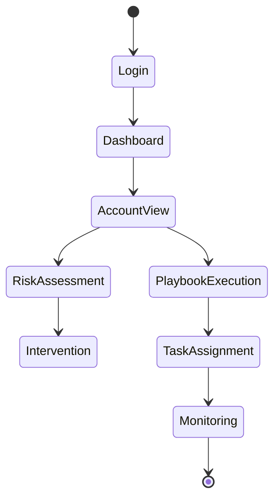
```mermaid
stateDiagram-v2
    [*] --> Login
    Login --> Dashboard
    Dashboard --> AccountView
    AccountView --> RiskAssessment
    AccountView --> PlaybookExecution
    RiskAssessment --> Intervention
    PlaybookExecution --> TaskAssignment
    TaskAssignment --> Monitoring
    Monitoring --> [*]
```

## 3.2 DATABASE DESIGN

### 3.2.1 Schema Design

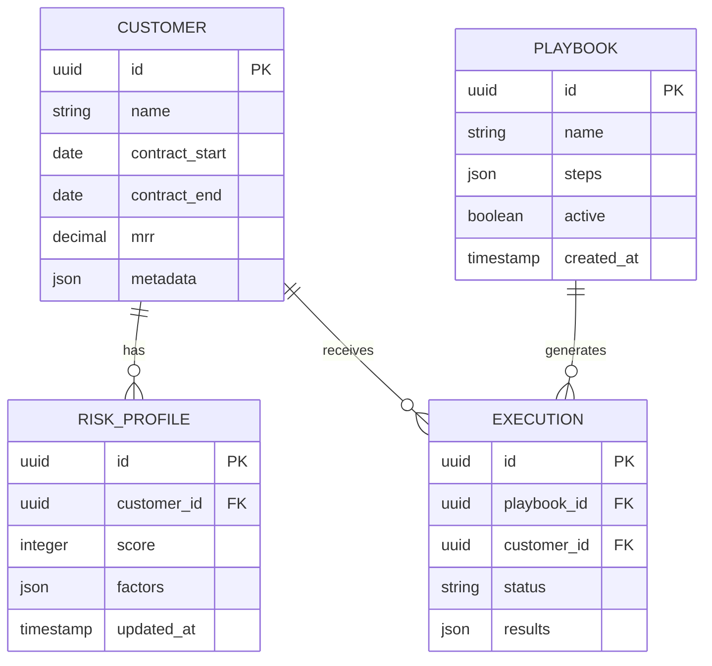
```mermaid
erDiagram
    CUSTOMER {
        uuid id PK
        string name
        date contract_start
        date contract_end
        decimal mrr
        json metadata
    }

    RISK_PROFILE {
        uuid id PK
        uuid customer_id FK
        integer score
        json factors
        timestamp updated_at
    }

    PLAYBOOK {
        uuid id PK
        string name
        json steps
        boolean active
        timestamp created_at
    }

    EXECUTION {
        uuid id PK
        uuid playbook_id FK
        uuid customer_id FK
        string status
        json results
    }

    CUSTOMER ||--o{ RISK_PROFILE : has
    CUSTOMER ||--o{ EXECUTION : receives
    PLAYBOOK ||--o{ EXECUTION : generates
```

### 3.2.2 Data Management Strategy

| Aspect | Implementation |
|--------|---------------|
| Partitioning | - Time-based partitioning for metrics<br>- Hash partitioning for customer data<br>- Range partitioning for historical data |
| Indexing | - B-tree indexes for customer lookups<br>- Bitmap indexes for status fields<br>- GiST indexes for JSON search |
| Archival | - 90-day active window in primary storage<br>- 1-year in warm storage<br>- 7-year cold storage retention |
| Backup | - Hourly incremental snapshots<br>- Daily full backups<br>- Cross-region replication |

## 3.3 API DESIGN

### 3.3.1 API Architecture

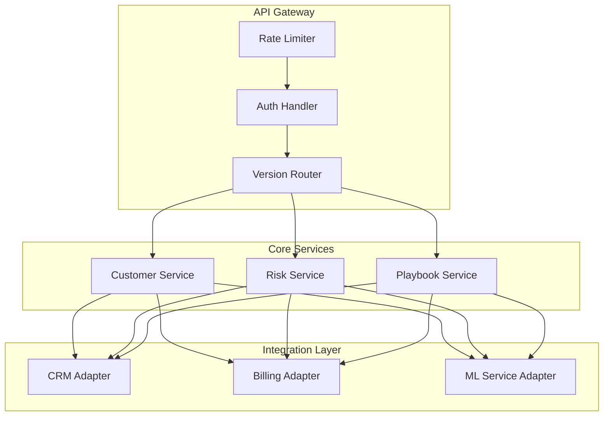
```mermaid
graph TD
    subgraph API Gateway
        A[Rate Limiter]
        B[Auth Handler]
        C[Version Router]
    end

    subgraph Core Services
        D[Customer Service]
        E[Risk Service]
        F[Playbook Service]
    end

    subgraph Integration Layer
        G[CRM Adapter]
        H[Billing Adapter]
        I[ML Service Adapter]
    end

    A --> B
    B --> C
    C --> D & E & F
    D & E & F --> G & H & I
```

### 3.3.2 Interface Specifications

| Endpoint Category | Authentication | Rate Limit | Caching |
|------------------|----------------|------------|----------|
| Customer APIs | OAuth 2.0 + JWT | 1000/hour | 5 min TTL |
| Risk Score APIs | OAuth 2.0 + JWT | 500/hour | 15 min TTL |
| Playbook APIs | OAuth 2.0 + JWT | 200/hour | 30 min TTL |
| Analytics APIs | OAuth 2.0 + JWT | 100/hour | 60 min TTL |

### 3.3.3 Integration Patterns

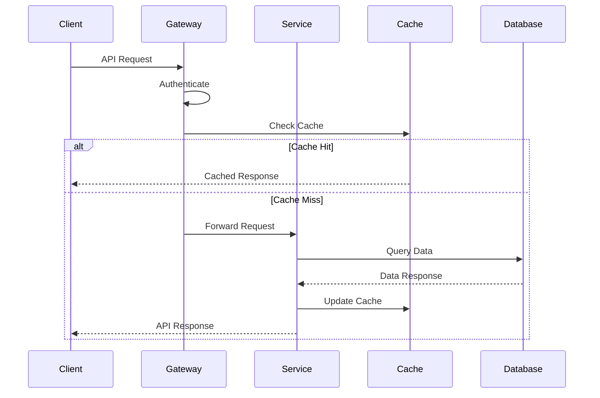
```mermaid
sequenceDiagram
    participant Client
    participant Gateway
    participant Service
    participant Cache
    participant Database

    Client->>Gateway: API Request
    Gateway->>Gateway: Authenticate
    Gateway->>Cache: Check Cache
    alt Cache Hit
        Cache-->>Client: Cached Response
    else Cache Miss
        Gateway->>Service: Forward Request
        Service->>Database: Query Data
        Database-->>Service: Data Response
        Service->>Cache: Update Cache
        Service-->>Client: API Response
    end
```

# 4. TECHNOLOGY STACK

## 4.1 PROGRAMMING LANGUAGES

| Platform | Language | Version | Justification |
|----------|----------|---------|---------------|
| Frontend | TypeScript | 5.0+ | - Type safety for enterprise scale<br>- Blitzy Page Builder compatibility<br>- Enhanced IDE support |
| Backend | Python | 3.11+ | - AWS SageMaker integration<br>- ML library ecosystem<br>- Blitzy Tables SDK support |
| ML Services | Python | 3.11+ | - Native AWS SageMaker support<br>- Scikit-learn compatibility<br>- Extensive ML libraries |
| Automation | JavaScript | ES2022+ | - Blitzy Automation Studio requirement<br>- Native async/await support<br>- WebSocket handling |

## 4.2 FRAMEWORKS & LIBRARIES

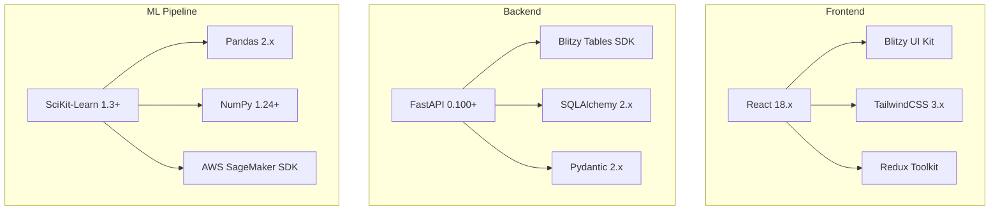
```mermaid
graph TD
    subgraph Frontend
        A[React 18.x] --> B[Blitzy UI Kit]
        A --> C[TailwindCSS 3.x]
        A --> D[Redux Toolkit]
    end

    subgraph Backend
        E[FastAPI 0.100+] --> F[Blitzy Tables SDK]
        E --> G[SQLAlchemy 2.x]
        E --> H[Pydantic 2.x]
    end

    subgraph ML Pipeline
        I[SciKit-Learn 1.3+] --> J[Pandas 2.x]
        I --> K[NumPy 1.24+]
        I --> L[AWS SageMaker SDK]
    end
```

### Core Frameworks

| Layer | Framework | Version | Purpose |
|-------|-----------|---------|---------|
| Frontend | React | 18.x | - Blitzy Page Builder requirement<br>- Component reusability<br>- Performance optimization |
| API | FastAPI | 0.100+ | - High performance async<br>- OpenAPI integration<br>- Type validation |
| ORM | SQLAlchemy | 2.x | - Blitzy Tables integration<br>- Complex query support<br>- Migration management |
| ML | SciKit-Learn | 1.3+ | - Model training pipeline<br>- Feature engineering<br>- Prediction serving |

## 4.3 DATABASES & STORAGE

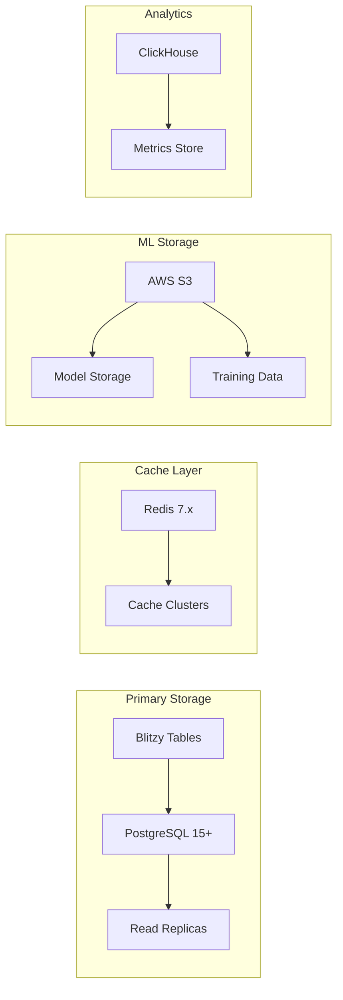
```mermaid
flowchart LR
    subgraph Primary Storage
        A[Blitzy Tables] --> B[PostgreSQL 15+]
        B --> C[Read Replicas]
    end

    subgraph Cache Layer
        D[Redis 7.x] --> E[Cache Clusters]
    end

    subgraph ML Storage
        F[AWS S3] --> G[Model Storage]
        F --> H[Training Data]
    end

    subgraph Analytics
        I[ClickHouse] --> J[Metrics Store]
    end
```

| Storage Type | Technology | Purpose | Scaling Strategy |
|--------------|------------|---------|------------------|
| Primary DB | PostgreSQL 15+ | Transactional data | Horizontal read replicas |
| Cache | Redis 7.x | Session, API cache | Redis Cluster |
| Object Storage | AWS S3 | ML models, files | S3 lifecycle policies |
| Analytics | ClickHouse | Metrics, logging | Sharding |

## 4.4 THIRD-PARTY SERVICES

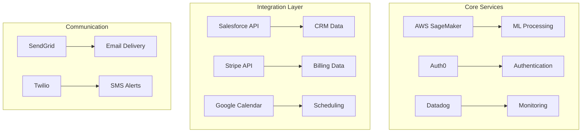
```mermaid
graph TD
    subgraph Core Services
        A[AWS SageMaker] --> B[ML Processing]
        C[Auth0] --> D[Authentication]
        E[Datadog] --> F[Monitoring]
    end

    subgraph Integration Layer
        G[Salesforce API] --> H[CRM Data]
        I[Stripe API] --> J[Billing Data]
        K[Google Calendar] --> L[Scheduling]
    end

    subgraph Communication
        M[SendGrid] --> N[Email Delivery]
        O[Twilio] --> P[SMS Alerts]
    end
```

| Service Category | Provider | Integration Method |
|-----------------|----------|-------------------|
| ML Infrastructure | AWS SageMaker | AWS SDK |
| Authentication | Auth0 | OAuth 2.0/OIDC |
| Monitoring | Datadog | Agent + API |
| Email | SendGrid | SMTP/API |
| CRM | Salesforce | REST API |

## 4.5 DEVELOPMENT & DEPLOYMENT

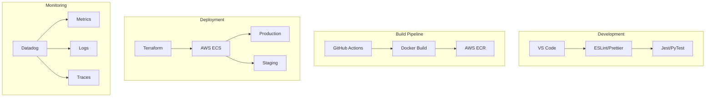
```mermaid
flowchart TD
    subgraph Development
        A[VS Code] --> B[ESLint/Prettier]
        B --> C[Jest/PyTest]
    end

    subgraph Build Pipeline
        D[GitHub Actions] --> E[Docker Build]
        E --> F[AWS ECR]
    end

    subgraph Deployment
        G[Terraform] --> H[AWS ECS]
        H --> I[Production]
        H --> J[Staging]
    end

    subgraph Monitoring
        K[Datadog] --> L[Metrics]
        K --> M[Logs]
        K --> N[Traces]
    end
```

| Category | Tool | Version | Purpose |
|----------|------|---------|---------|
| IDE | VS Code | Latest | Development environment |
| Version Control | Git | 2.40+ | Source control |
| CI/CD | GitHub Actions | N/A | Automation pipeline |
| IaC | Terraform | 1.5+ | Infrastructure management |
| Containers | Docker | 24.x | Application packaging |
| Registry | AWS ECR | N/A | Container storage |

# 5. SYSTEM DESIGN

## 5.1 USER INTERFACE DESIGN

### 5.1.1 Layout Structure

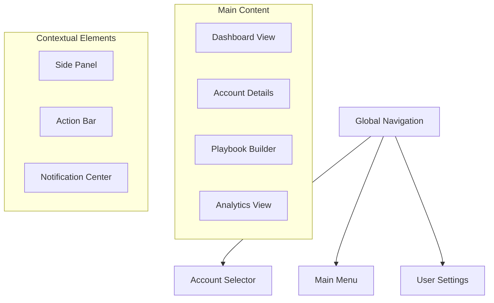
```mermaid
graph TD
    A[Global Navigation] --> B[Account Selector]
    A --> C[Main Menu]
    A --> D[User Settings]
    
    subgraph Main Content
        E[Dashboard View]
        F[Account Details]
        G[Playbook Builder]
        H[Analytics View]
    end
    
    subgraph Contextual Elements
        I[Side Panel]
        J[Action Bar]
        K[Notification Center]
    end
```

### 5.1.2 Core Interface Components

| Component | Purpose | Key Features |
|-----------|---------|--------------|
| Executive Dashboard | High-level metrics overview | - KPI summary cards<br>- Risk distribution chart<br>- Revenue impact widgets |
| Account Workbench | Customer account management | - Health score timeline<br>- Interaction history<br>- Playbook status |
| Playbook Builder | Workflow automation design | - Drag-drop interface<br>- Template library<br>- Logic flow designer |
| Analytics Console | Performance reporting | - Custom report builder<br>- Metric comparison<br>- Export options |

### 5.1.3 Responsive Breakpoints

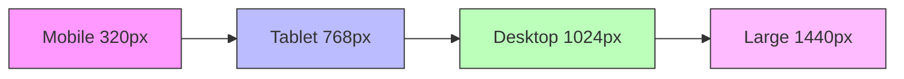
```mermaid
graph LR
    A[Mobile 320px] --> B[Tablet 768px]
    B --> C[Desktop 1024px]
    C --> D[Large 1440px]
    
    style A fill:#f9f,stroke:#333
    style B fill:#bbf,stroke:#333
    style C fill:#bfb,stroke:#333
    style D fill:#fbf,stroke:#333
```

## 5.2 DATABASE DESIGN

### 5.2.1 Data Model

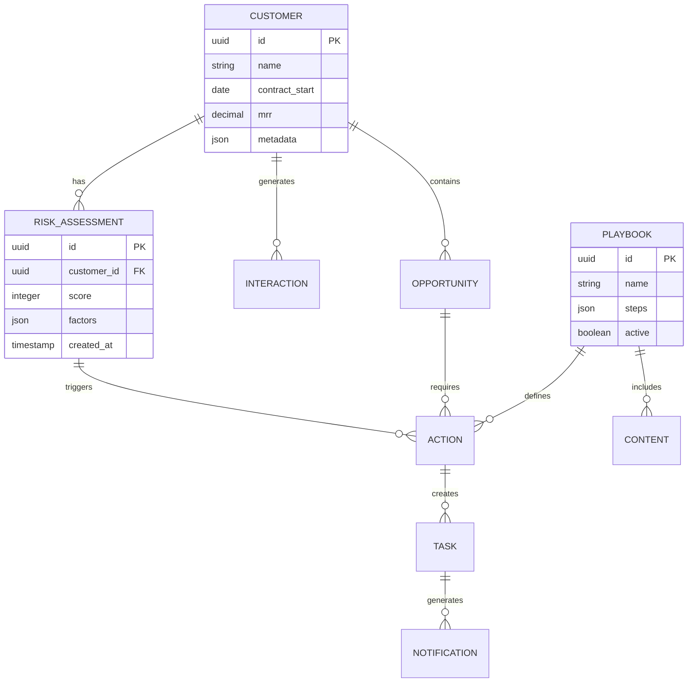
```mermaid
erDiagram
    CUSTOMER ||--o{ RISK_ASSESSMENT : has
    CUSTOMER ||--o{ INTERACTION : generates
    CUSTOMER ||--o{ OPPORTUNITY : contains
    
    RISK_ASSESSMENT ||--o{ ACTION : triggers
    OPPORTUNITY ||--o{ ACTION : requires
    
    PLAYBOOK ||--o{ ACTION : defines
    PLAYBOOK ||--o{ CONTENT : includes
    
    ACTION ||--o{ TASK : creates
    TASK ||--o{ NOTIFICATION : generates

    CUSTOMER {
        uuid id PK
        string name
        date contract_start
        decimal mrr
        json metadata
    }

    RISK_ASSESSMENT {
        uuid id PK
        uuid customer_id FK
        integer score
        json factors
        timestamp created_at
    }

    PLAYBOOK {
        uuid id PK
        string name
        json steps
        boolean active
    }
```

### 5.2.2 Storage Strategy

| Data Type | Storage Solution | Retention Policy |
|-----------|-----------------|------------------|
| Transactional | Blitzy Tables | 90 days active |
| Historical | AWS S3 | 7 years archived |
| ML Features | SageMaker Store | 30 days rolling |
| Analytics | ClickHouse | 12 months active |

## 5.3 API DESIGN

### 5.3.1 API Architecture

```mermaid
graph TD
    subgraph Client Layer
        A[Web Application]
        B[External Systems]
    end
    
    subgraph API Gateway
        C[Authentication]
        D[Rate Limiting]
        E[Request Routing]
    end
    
    subgraph Service Layer
        F[Customer Service]
        G[Risk Service]
        H[Playbook Service]
    end
    
    A & B --> C
    C --> D
    D --> E
    E --> F & G & H
```

### 5.3.2 Endpoint Specifications

| Endpoint | Method | Purpose | Rate Limit |
|----------|--------|---------|------------|
| /api/v1/customers | GET/POST | Customer management | 1000/hour |
| /api/v1/risk-scores | GET | Risk assessment | 500/hour |
| /api/v1/playbooks | GET/POST | Playbook operations | 200/hour |
| /api/v1/analytics | GET | Performance metrics | 100/hour |

### 5.3.3 Data Flow

```mermaid
sequenceDiagram
    participant Client
    participant Gateway
    participant Service
    participant Cache
    participant Database

    Client->>Gateway: API Request
    Gateway->>Gateway: Authenticate
    Gateway->>Cache: Check Cache
    alt Cache Hit
        Cache-->>Client: Return Data
    else Cache Miss
        Gateway->>Service: Process Request
        Service->>Database: Query Data
        Database-->>Service: Return Data
        Service->>Cache: Update Cache
        Service-->>Client: Return Response
    end
```

# 6. USER INTERFACE DESIGN

## 6.1 Interface Components Key

```
Icons:
[?] - Help/Information tooltip
[$] - Financial/Revenue data
[i] - Informational element
[+] - Add/Create action
[x] - Close/Delete action
[<][>] - Navigation controls
[^] - Upload functionality
[#] - Menu/Dashboard
[@] - User profile
[!] - Alert/Warning
[=] - Settings menu
[*] - Favorite/Important

Interactive Elements:
[ ] - Checkbox
( ) - Radio button
[Button] - Clickable button
[...] - Text input field
[====] - Progress indicator
[v] - Dropdown selector
```

## 6.2 Executive Dashboard

```
+----------------------------------------------------------+
|  [@] Admin User    [!] Alerts(3)    [?] Help    [=] Menu  |
+----------------------------------------------------------+
|                                                           |
|  Customer Health Overview                         [^] Export|
|  +------------------------+  +----------------------+      |
|  |  At-Risk Accounts     |  |  Revenue Impact      |     |
|  |  [!] 24 Critical      |  |  [$] $2.4M at risk   |     |
|  |  [i] 56 Warning       |  |  [====] 67% of goal  |     |
|  +------------------------+  +----------------------+      |
|                                                          |
|  Quick Actions                                           |
|  [Button: Create Playbook] [Button: Bulk Assign] [+] New |
|                                                          |
|  Active Interventions                                    |
|  +--------------------------------------------------+   |
|  | Account     | Risk Score | Owner    | Status      |   |
|  | Acme Corp   | [*] 89     | @sarah   | [====] 60%  |   |
|  | TechStart   | [!] 92     | @mike    | [====] 30%  |   |
|  | DataCo      | [i] 78     | @john    | [====] 85%  |   |
|  +--------------------------------------------------+   |
|                                          [>] View All    |
+----------------------------------------------------------+
```

## 6.3 Account Workbench

```
+----------------------------------------------------------+
|  [<] Back to Dashboard    Account: Acme Corporation        |
+----------------------------------------------------------+
|  Risk Score: [!] 89                                       |
|  +------------------------+  +----------------------+      |
|  |  Health Metrics       |  |  Revenue Details     |     |
|  |  Usage    [====] 45%  |  |  MRR    [$] $45,000 |     |
|  |  Adoption [====] 62%  |  |  Growth [====] 5%    |     |
|  |  Support  [====] 88%  |  |  Churn Risk: High   |     |
|  +------------------------+  +----------------------+      |
|                                                          |
|  Intervention Actions                                    |
|  ( ) Email Campaign                                      |
|  ( ) Executive Review                                    |
|  ( ) Training Session                                    |
|  [Button: Execute Selected]                              |
|                                                          |
|  Recent Activities                                       |
|  +--------------------------------------------------+   |
|  | Date       | Type        | Owner    | Result      |   |
|  | 2024-01-20 | QBR         | @sarah   | Completed   |   |
|  | 2024-01-15 | Training    | @mike    | Scheduled   |   |
|  | 2024-01-10 | Support     | @john    | Resolved    |   |
|  +--------------------------------------------------+   |
+----------------------------------------------------------+
```

## 6.4 Playbook Builder

```
+----------------------------------------------------------+
|  [#] Playbooks > Create New                               |
+----------------------------------------------------------+
|  Name: [...........................]                       |
|  Description: [...................................]        |
|                                                           |
|  Trigger Conditions                                       |
|  +--------------------------------------------------+    |
|  | [+] Add Condition                                 |    |
|  | [x] Risk Score > 80                              |    |
|  | [x] Usage Decline > 20%                          |    |
|  +--------------------------------------------------+    |
|                                                           |
|  Action Sequence                                          |
|  +--------------------------------------------------+    |
|  | 1. [v] Select Action Type                        |    |
|  |    [ ] Auto-assign to CSM                        |    |
|  |    [ ] Send email alert                          |    |
|  |    [ ] Schedule meeting                          |    |
|  |                                                  |    |
|  | 2. [v] Select Action Type                        |    |
|  |    [ ] Create task                              |    |
|  |    [ ] Update risk score                        |    |
|  |    [ ] Log interaction                          |    |
|  +--------------------------------------------------+    |
|                                                           |
|  [Button: Save Draft]        [Button: Activate Playbook]  |
+----------------------------------------------------------+
```

## 6.5 Analytics Console

```
+----------------------------------------------------------+
|  Performance Analytics                           [$] ROI   |
+----------------------------------------------------------+
|  Time Range: [v] Last 30 Days                            |
|                                                          |
|  Key Metrics                                            |
|  +------------------------+  +----------------------+     |
|  |  Retention Rate       |  |  Expansion Revenue   |     |
|  |  [====] 94%          |  |  [$] $1.2M          |     |
|  |  vs Last Period: +2%  |  |  vs Target: +15%    |     |
|  +------------------------+  +----------------------+     |
|                                                          |
|  Intervention Success                                    |
|  +--------------------------------------------------+   |
|  | Type        | Count | Success | Impact           |   |
|  | Training    | 145   | 89%     | [$] $450K       |   |
|  | QBR         | 89    | 92%     | [$] $680K       |   |
|  | Support     | 234   | 78%     | [$] $320K       |   |
|  +--------------------------------------------------+   |
|                                                          |
|  [Button: Download Report]    [Button: Share Dashboard]  |
+----------------------------------------------------------+
```

## 6.6 Responsive Design Breakpoints

The interface adapts to the following screen sizes:
- Desktop (1440px+): Full feature set with expanded views
- Laptop (1024px-1439px): Optimized layout with collapsible panels
- Tablet (768px-1023px): Stacked components with touch-friendly controls
- Mobile (320px-767px): Essential features with simplified navigation

All interfaces follow Blitzy Enterprise Design System guidelines and support both light and dark themes through the Blitzy Theme Engine.

# 7. SECURITY CONSIDERATIONS

## 7.1 AUTHENTICATION AND AUTHORIZATION

```mermaid
flowchart TD
    A[User Access Request] --> B{Authentication Layer}
    B -->|Valid Credentials| C[Blitzy SSO]
    B -->|Invalid| D[Access Denied]
    C --> E{Authorization Check}
    E -->|Authorized| F[Access Granted]
    E -->|Unauthorized| G[Permission Denied]
    
    subgraph Role Based Access
        H[Admin] --> I[Full Access]
        J[CS Manager] --> K[Team Access]
        L[CS Rep] --> M[Account Access]
        N[Viewer] --> O[Read Access]
    end
```

| Authentication Method | Implementation | Purpose |
|----------------------|----------------|----------|
| Blitzy Enterprise SSO | SAML 2.0 | Primary authentication |
| Multi-Factor Authentication | Time-based OTP | Additional security layer |
| API Authentication | OAuth 2.0 + JWT | Service authentication |
| Session Management | Redis-backed tokens | User session tracking |

## 7.2 DATA SECURITY

| Security Layer | Implementation | Protection Level |
|----------------|----------------|-----------------|
| Data at Rest | AES-256 encryption | All stored data |
| Data in Transit | TLS 1.3 | All network traffic |
| Database Security | Row-level security in Blitzy Tables | Per-tenant isolation |
| Field Encryption | AWS KMS | PII and sensitive fields |
| Backup Encryption | AES-256 | All backup data |

```mermaid
graph TD
    subgraph Data Classification
        A[Public] --> B[Internal]
        B --> C[Confidential]
        C --> D[Restricted]
    end
    
    subgraph Security Controls
        E[Encryption] --> F[Access Control]
        F --> G[Audit Logging]
        G --> H[Data Masking]
    end
```

## 7.3 SECURITY PROTOCOLS

### 7.3.1 Network Security

| Protocol | Implementation | Purpose |
|----------|----------------|---------|
| Web Application Firewall | Blitzy Cloud WAF | DDoS protection |
| API Gateway | Rate limiting, IP filtering | API security |
| VPC Configuration | Private subnets | Network isolation |
| Load Balancer | TLS termination | Traffic encryption |

### 7.3.2 Compliance Controls

```mermaid
graph LR
    subgraph Compliance Framework
        A[GDPR] --> B[Data Processing]
        C[SOC 2] --> D[Security Controls]
        E[ISO 27001] --> F[Security Management]
    end
    
    subgraph Monitoring
        G[Security Events]
        H[Audit Logs]
        I[Access Reports]
    end
    
    B & D & F --> G & H & I
```

### 7.3.3 Security Monitoring

| Monitoring Type | Tool | Frequency |
|----------------|------|-----------|
| Security Scanning | Blitzy Security Scanner | Daily |
| Vulnerability Assessment | AWS Inspector | Weekly |
| Penetration Testing | Third-party service | Quarterly |
| Access Review | Blitzy Access Manager | Monthly |
| Security Auditing | Blitzy Activity Log | Real-time |

### 7.3.4 Incident Response

```mermaid
stateDiagram-v2
    [*] --> Detection
    Detection --> Analysis
    Analysis --> Containment
    Containment --> Eradication
    Eradication --> Recovery
    Recovery --> PostIncident
    PostIncident --> [*]
```

| Phase | Actions | Responsibility |
|-------|---------|---------------|
| Detection | Monitor security alerts | Security Team |
| Analysis | Assess impact and scope | Security + DevOps |
| Containment | Isolate affected systems | DevOps Team |
| Eradication | Remove security threats | Security Team |
| Recovery | Restore normal operations | DevOps + Development |
| Post-Incident | Document and improve | All Teams |

# 8. INFRASTRUCTURE

## 8.1 DEPLOYMENT ENVIRONMENT

The Customer Success AI Platform utilizes a cloud-native architecture deployed exclusively on AWS through Blitzy Cloud infrastructure.

| Environment | Purpose | Configuration |
|-------------|---------|---------------|
| Production | Live system | Multi-AZ deployment across 3 zones |
| Staging | Pre-production testing | Single-AZ with production parity |
| Development | Feature development | Containerized environment |
| QA | Testing and validation | Isolated test environment |

```mermaid
graph TD
    subgraph Production Environment
        A[Load Balancer] --> B[Web Tier]
        B --> C[Application Tier]
        C --> D[Data Tier]
        
        subgraph High Availability
            E[Zone A]
            F[Zone B]
            G[Zone C]
        end
    end
    
    subgraph Support Environments
        H[Staging]
        I[Development]
        J[QA]
    end
    
    K[CI/CD Pipeline] --> Production Environment
    K --> Support Environments
```

## 8.2 CLOUD SERVICES

| Service | Purpose | Configuration |
|---------|---------|---------------|
| AWS ECS | Container hosting | Auto-scaling groups |
| AWS RDS | Database hosting | Multi-AZ PostgreSQL |
| AWS ElastiCache | Redis caching | Cluster mode enabled |
| AWS SageMaker | ML model hosting | On-demand inference |
| AWS CloudFront | CDN delivery | Global edge locations |
| AWS S3 | Object storage | Lifecycle policies |
| AWS KMS | Key management | Automatic rotation |

## 8.3 CONTAINERIZATION

```mermaid
graph LR
    subgraph Container Architecture
        A[Base Image] --> B[Blitzy Runtime]
        B --> C[Application Layer]
        
        subgraph Services
            D[Web Service]
            E[API Service]
            F[Worker Service]
        end
        
        C --> D & E & F
    end
```

| Component | Image | Configuration |
|-----------|-------|---------------|
| Base Image | Alpine Linux | Minimal secure base |
| Runtime | Blitzy Enterprise | Production-optimized |
| Web Service | Node 18 | Auto-scaling enabled |
| API Service | Python 3.11 | Horizontal scaling |
| Workers | Python 3.11 | Queue-based scaling |

## 8.4 ORCHESTRATION

```mermaid
graph TD
    subgraph ECS Cluster
        A[Service Discovery] --> B[Task Definitions]
        B --> C[Container Instances]
        
        subgraph Auto Scaling
            D[Target Tracking]
            E[Step Scaling]
        end
        
        C --> D & E
    end
```

| Component | Configuration | Scaling Policy |
|-----------|--------------|----------------|
| ECS Services | FARGATE | CPU/Memory based |
| Task Definitions | Production-optimized | Resource limits |
| Auto Scaling | Target tracking | 70% threshold |
| Load Balancing | Application LB | Cross-zone |

## 8.5 CI/CD PIPELINE

```mermaid
flowchart LR
    subgraph CI Pipeline
        A[Source] --> B[Build]
        B --> C[Test]
        C --> D[Security Scan]
    end
    
    subgraph CD Pipeline
        D --> E[Artifact Creation]
        E --> F[Staging Deploy]
        F --> G[Integration Tests]
        G --> H[Production Deploy]
    end
    
    subgraph Monitoring
        H --> I[Health Checks]
        I --> J[Metrics]
        J --> K[Alerts]
    end
```

| Stage | Tools | Purpose |
|-------|-------|---------|
| Source Control | GitHub Enterprise | Version control |
| Build | GitHub Actions | Container builds |
| Testing | Jest/PyTest | Automated testing |
| Security | Snyk/SonarQube | Vulnerability scanning |
| Deployment | Terraform | Infrastructure as Code |
| Monitoring | Datadog | Performance tracking |

### Deployment Process

1. Code commit triggers GitHub Actions workflow
2. Automated tests and security scans run
3. Container images built and pushed to AWS ECR
4. Terraform applies infrastructure changes
5. Blue-green deployment to production
6. Health checks validate deployment
7. Automated rollback if needed

# 9. APPENDICES

## 9.1 ADDITIONAL TECHNICAL INFORMATION

### ML Model Performance Metrics

| Metric | Target | Measurement Period |
|--------|--------|-------------------|
| Prediction Accuracy | >90% | Rolling 30-day |
| False Positive Rate | <5% | Per prediction cycle |
| Model Retraining Time | <4 hours | Weekly schedule |
| Feature Importance Score | >0.7 | Per feature |
| Model Drift Threshold | <10% | Monthly evaluation |

### Integration Rate Limits

| Integration | Requests/Hour | Burst Limit | Retry Policy |
|-------------|--------------|-------------|--------------|
| Salesforce API | 1000 | 1500 | Exponential backoff |
| Stripe API | 500 | 750 | 3 retries, 5s delay |
| Google Calendar | 200 | 300 | Linear backoff |
| AWS SageMaker | 100 | 150 | Circuit breaker |

## 9.2 GLOSSARY

| Term | Definition |
|------|------------|
| Account Health Score | Composite metric combining usage patterns, engagement levels, and support history |
| Automation Studio | Blitzy's workflow automation engine for creating and executing customer success playbooks |
| Churn Prediction | ML-based assessment of customer likelihood to cancel service |
| Customer Journey Map | Visual representation of customer interactions and touchpoints over time |
| Feature Store | Centralized repository for storing and managing ML model features |
| Intervention Playbook | Pre-defined sequence of actions triggered by specific customer behavior patterns |
| Revenue Impact Analysis | Calculation of financial effects from customer churn or expansion opportunities |
| Risk Factor | Individual metric contributing to overall customer health assessment |

## 9.3 ACRONYMS

| Acronym | Definition |
|---------|------------|
| AI | Artificial Intelligence |
| API | Application Programming Interface |
| CDN | Content Delivery Network |
| CMS | Content Management System |
| CRM | Customer Relationship Management |
| CSM | Customer Success Manager |
| ETL | Extract, Transform, Load |
| GDPR | General Data Protection Regulation |
| IaC | Infrastructure as Code |
| JWT | JSON Web Token |
| KMS | Key Management Service |
| KPI | Key Performance Indicator |
| ML | Machine Learning |
| MRR | Monthly Recurring Revenue |
| PII | Personally Identifiable Information |
| REST | Representational State Transfer |
| ROI | Return on Investment |
| SaaS | Software as a Service |
| SDK | Software Development Kit |
| SLA | Service Level Agreement |
| SSO | Single Sign-On |
| TLS | Transport Layer Security |
| UI | User Interface |
| WAF | Web Application Firewall |

## 9.4 SYSTEM DEPENDENCIES

```mermaid
graph TD
    subgraph Core Platform
        A[Blitzy Page Builder] --> B[Frontend Layer]
        C[Blitzy Tables] --> D[Data Layer]
        E[Blitzy AI Builder] --> F[ML Layer]
    end
    
    subgraph External Services
        G[AWS SageMaker]
        H[Auth0 SSO]
        I[Datadog APM]
    end
    
    subgraph Integration Layer
        J[CRM Systems]
        K[Billing Platforms]
        L[Calendar Services]
    end
    
    B & D & F --> G
    B --> H
    B & D & F --> I
    D --> J & K & L
```

## 9.5 ERROR CODES AND HANDLING

| Error Code | Description | Handling Strategy |
|------------|-------------|------------------|
| AUTH001 | Authentication failure | Redirect to SSO |
| DATA001 | Data validation error | Display field-level errors |
| PRED001 | Prediction service unavailable | Use cached predictions |
| SYNC001 | Integration sync failure | Queue for retry |
| RATE001 | Rate limit exceeded | Implement backoff strategy |
| PLAY001 | Playbook execution error | Rollback to previous state |
| ML001 | Model inference error | Use fallback model |